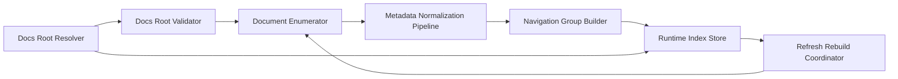

# Logical Components

## Component 1: Docs Root Resolver

- **Purpose**: Determine the active docs root from automatic discovery or manual override.
- **NFR Responsibilities**:
  - enforce single active root semantics
  - distinguish auto-detected and manual sources
  - preserve valid previous state on invalid replacement attempts
- **Patterns Applied**:
  - Single Active Root Selector
  - Boundary-Validated Path Handling

## Component 2: Docs Root Validator

- **Purpose**: Validate that a candidate path is safe and usable as a docs root.
- **NFR Responsibilities**:
  - validate path boundary suitability
  - reject malformed or unrelated roots
  - provide explicit invalid reasons
- **Patterns Applied**:
  - Boundary-Validated Path Handling
  - Explicit State Partitioning

## Component 3: Document Enumerator

- **Purpose**: Enumerate candidate markdown files within the active docs root only.
- **NFR Responsibilities**:
  - scope enumeration to the active root
  - exclude non-markdown runtime documents
  - provide stable source input to normalization
- **Patterns Applied**:
  - Host-Side Trusted Index Builder
  - Boundary-Validated Path Handling

## Component 4: Metadata Normalization Pipeline

- **Purpose**: Convert enumerated documents into normalized runtime records.
- **NFR Responsibilities**:
  - derive stable relative paths
  - resolve titles deterministically
  - map AIDLC phases, sections, and subsections
- **Patterns Applied**:
  - Deterministic Normalization Pipeline
  - Pure Helper First Design

## Component 5: Navigation Group Builder

- **Purpose**: Build grouped navigation state from normalized document records.
- **NFR Responsibilities**:
  - derive phase/section/subsection group structure
  - keep ordering and grouping deterministic
  - expose stable read-only grouped output
- **Patterns Applied**:
  - Deterministic Normalization Pipeline
  - Read-Only Runtime Index Contract

## Component 6: Runtime Index Store

- **Purpose**: Hold the active index, the last known valid index, and state partition information.
- **NFR Responsibilities**:
  - keep valid and invalid states distinct
  - support controlled replacement semantics
  - expose read-only index state downstream
- **Patterns Applied**:
  - Atomic Index Replacement
  - Explicit State Partitioning
  - Read-Only Runtime Index Contract

## Component 7: Refresh Rebuild Coordinator

- **Purpose**: Orchestrate safe refresh-triggered rebuilds of the runtime index.
- **NFR Responsibilities**:
  - trigger rebuilds from refresh inputs
  - validate rebuilt indexes before replacement
  - preserve prior valid state on failure
- **Patterns Applied**:
  - Atomic Index Replacement
  - Explicit State Partitioning

## Logical Interaction Model

## Text Alternative

- The Docs Root Resolver chooses or replaces the active root.
- The Docs Root Validator confirms that the candidate root is valid.
- The Document Enumerator scans markdown files within that boundary.
- The Metadata Normalization Pipeline derives stable runtime records.
- The Navigation Group Builder turns those records into grouped output.
- The Runtime Index Store holds current and last valid state.
- The Refresh Rebuild Coordinator safely rebuilds and replaces the index only after validation succeeds.
