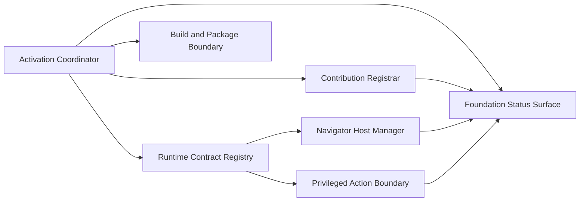

# Logical Components

## Component 1: Activation Coordinator

- **Purpose**: Own the single-entry initialization flow for the extension runtime.
- **NFR Responsibilities**:
  - enforce single-initialization guard
  - sequence shared service startup
  - emit runtime lifecycle states
- **Patterns Applied**:
  - Single-Initialization Guard
  - Runtime Status Boundary

## Component 2: Contribution Registrar

- **Purpose**: Register commands, views, and providers with explicit success/failure tracking.
- **NFR Responsibilities**:
  - validate unique command and contribution identities
  - distinguish critical and non-critical registration outcomes
  - update capability availability
- **Patterns Applied**:
  - Fail-Closed Registration and Host Provisioning
  - Capability Registry Pattern

## Component 3: Runtime Contract Registry

- **Purpose**: Store and expose the shared host/webview contracts used by downstream units.
- **NFR Responsibilities**:
  - centralize typed contract definitions
  - validate allowed actions and payload shapes
  - support versionable contract growth
- **Patterns Applied**:
  - Contract-First Host/Webview Boundary
  - Packaging-Ready Source Separation

## Component 4: Navigator Host Manager

- **Purpose**: Manage the lifecycle of dedicated panel and side-view navigator hosts.
- **NFR Responsibilities**:
  - reuse compatible hosts when valid
  - keep host behavior predictable
  - provide a shared base for downstream navigator logic
- **Patterns Applied**:
  - Shared Host Abstraction
  - Runtime Status Boundary

## Component 5: Foundation Status Surface

- **Purpose**: Expose explicit readiness, degraded, and failed states to host shells and downstream units.
- **NFR Responsibilities**:
  - provide deterministic status snapshots
  - isolate degraded-state behavior from feature-specific logic
  - support testing of startup and failure scenarios
- **Patterns Applied**:
  - Runtime Status Boundary
  - Capability Registry Pattern

## Component 6: Privileged Action Boundary

- **Purpose**: Define the host-side boundary where privileged extension actions are accepted and validated.
- **NFR Responsibilities**:
  - keep privileged operations outside webview code
  - validate host capability requests
  - preserve fail-closed behavior for unsafe operations
- **Patterns Applied**:
  - Separation of Privileged Operations
  - Contract-First Host/Webview Boundary

## Component 7: Build and Package Boundary

- **Purpose**: Preserve a source and configuration layout that remains compatible with later packaging and test validation.
- **NFR Responsibilities**:
  - keep host and webview code paths separated
  - maintain compatibility with package-driven extension metadata
  - support future validation tooling without structural rework
- **Patterns Applied**:
  - Packaging-Ready Source Separation

## Logical Interaction Model

## Text Alternative

- The Activation Coordinator starts the runtime and sequences the foundation flow.
- The Contribution Registrar and Runtime Contract Registry establish what the runtime can safely expose.
- The Navigator Host Manager and Privileged Action Boundary consume those definitions to provide safe UI-host and action-boundary behavior.
- The Foundation Status Surface keeps runtime health explicit.
- The Build and Package Boundary preserves delivery-friendly project structure from the start.
