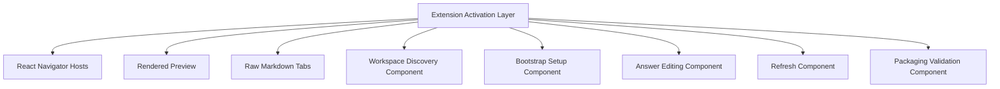

# Application Design

## Design Summary

The AIDLC VS Code extension will be organized around an extension-host orchestration layer, a React navigator available both as a dedicated panel and a side view, editor-area raw and rendered document experiences, and dedicated services for discovery, answer processing, save-back, refresh, and AIDLC bootstrap/setup. The design intentionally separates workspace file operations and setup logic from UI rendering concerns so the migration can preserve current capabilities while fitting VS Code-native workflows.

## Key Design Decisions

- Support both a dedicated navigator panel and a side-view host in the first delivery.
- Design bootstrap/setup for multiple AIDLC setup modes from the start.
- Replace manifest-file dependency with runtime discovery and indexing.
- Keep rendered answer editing distinct from broader raw markdown editing.
- Centralize host-side orchestration and keep file operations outside webview UI code.

## Artifact Index

- [components.md](./components.md)
- [component-methods.md](./component-methods.md)
- [services.md](./services.md)
- [component-dependency.md](./component-dependency.md)

## High-Level Architecture

## Text Alternative

- The extension activation layer initializes all runtime-facing components.
- React navigator hosts present the document tree in both panel and side-view experiences.
- Rendered previews and raw markdown tabs provide two complementary document interaction modes.
- Discovery, setup, answer editing, refresh, and packaging concerns remain isolated behind dedicated components and services.

## Design Completeness Check

- **Components defined**: Yes
- **High-level methods defined**: Yes
- **Service orchestration defined**: Yes
- **Dependencies and communication patterns defined**: Yes
- **Aligned with requirements and stories**: Yes

## Extension Rule Compliance Summary

### Security Baseline

- **SECURITY-01**: N/A at application-design stage. No storage resource design is introduced.
- **SECURITY-02**: N/A at application-design stage. No network intermediary design is introduced.
- **SECURITY-03**: Compliant. Host-side orchestration and isolated save/setup services preserve room for structured logging in later design and implementation.
- **SECURITY-04**: Compliant. Webview UI is isolated from host-side file operations, supporting later CSP and security-header policy decisions.
- **SECURITY-05**: Compliant. Save and setup flows are explicitly separated into host-side services where validation can be enforced.
- **SECURITY-06**: N/A at application-design stage. No IAM or access-policy model is defined.
- **SECURITY-07**: N/A at application-design stage. No network-configuration design exists.
- **SECURITY-08**: N/A at application-design stage. No authenticated application boundary is introduced.
- **SECURITY-09**: Compliant. Safe reinitialization and guarded file-operation boundaries are preserved in the design.
- **SECURITY-10**: Compliant. Packaging and validation are separated into a dedicated component for later enforcement.
- **SECURITY-11**: Compliant. Security-sensitive operations are isolated rather than scattered across UI components.
- **SECURITY-12**: N/A at application-design stage. No user authentication model is part of scope.
- **SECURITY-13**: Compliant. Packaging and validation remain first-class design concerns for later integrity checks.
- **SECURITY-14**: N/A at application-design stage. Monitoring/alerting is outside the current scope.
- **SECURITY-15**: Compliant. File and setup operations are designed to fail through host-side guarded services rather than UI code.

### Property-Based Testing

- **PBT-02**: Compliant. The design isolates answer rebuild and document transformation logic into testable services where round-trip properties can be applied later.
- **PBT-03**: Compliant. Discovery normalization and answer parsing logic are separated into units where invariants can be defined later.
- **PBT-07**: Compliant. The separation of pure transformation services supports domain-specific generator use in later testing.
- **PBT-08**: N/A at application-design stage. Reproducibility and CI execution details belong to later stages.
- **PBT-09**: Compliant. The design remains compatible with choosing a TypeScript property-based testing framework in later stages.
