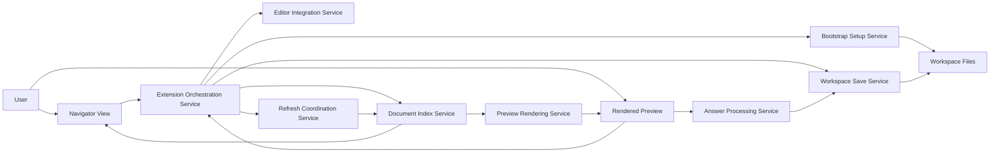

# Component Dependency

## Dependency Matrix

| Component | Depends On | Relationship |
|---|---|---|
| Extension Activation Layer | All services | Initializes and wires the runtime |
| Navigator View Component | Extension Orchestration Service, Document Index Service, Editor Integration Service, Bootstrap Setup Service, Refresh Coordination Service | Consumes state and dispatches actions |
| Rendered Preview Component | Preview Rendering Service, Answer Processing Service, Workspace Save Service, Refresh Coordination Service | Renders and saves document interactions |
| Raw Document Integration Component | Editor Integration Service | Opens native editor tabs |
| Workspace Discovery Component | Document Index Service, Refresh Coordination Service | Maintains docs-root and index state |
| Answer Editing Component | Answer Processing Service | Provides answer transformation behavior |
| Bootstrap Setup Component | Bootstrap Setup Service | Encapsulates setup UX and plan execution |
| Refresh and Synchronization Component | Refresh Coordination Service, Document Index Service | Keeps runtime state current |
| Packaging and Validation Component | Packaging Validation Service | Handles build/package validation concerns |

## Communication Patterns

- **Webview-to-Host Messaging**:
  - Navigator and preview UIs send structured actions to the extension host
  - The extension host returns state snapshots, results, or error payloads
- **Host-Orchestrated Service Calls**:
  - Extension orchestration coordinates discovery, preview, setup, save, and refresh work
- **Workspace Event Flow**:
  - File-change events feed the refresh coordination service
  - Refresh updates propagate to document index and UI state providers
- **Editor Integration Flow**:
  - Navigator actions trigger raw-tab or preview-tab opening through editor integration services

## Data Flow Diagram

## Text Alternative

- Users interact with the navigator and preview UIs.
- Those UIs send structured actions to the extension orchestration service.
- The orchestration layer routes requests to indexing, editor integration, setup, refresh, save, and answer-processing services.
- Workspace file changes flow through the refresh service back into the document index and visible UI state.

## Coupling Guidance

- UI components should not perform direct file writes.
- Bootstrap/setup logic should be isolated from preview and navigation rendering logic.
- Answer parsing/rebuild logic should remain independent from VS Code UI hosting so it can be tested directly.
- Packaging validation concerns should remain outside the main runtime interaction path.
