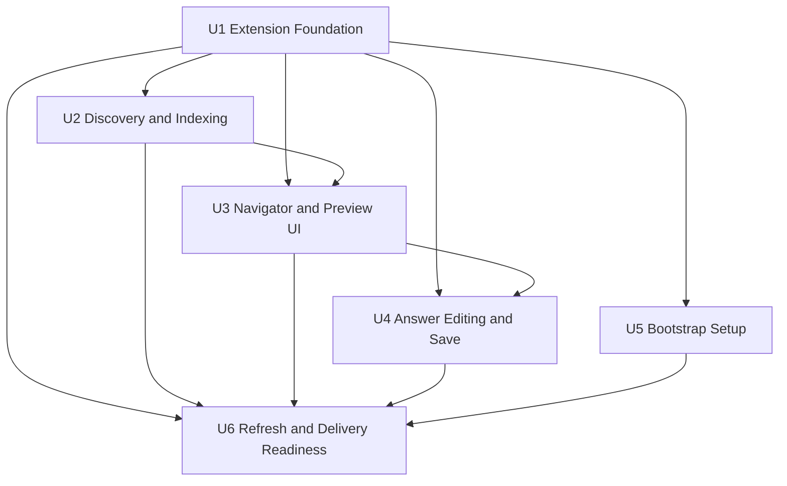

# Unit of Work Dependency

## Dependency Matrix

| Unit | Depends On | Dependency Type | Reason |
|---|---|---|---|
| Extension Foundation | None | None | Base extension shell and shared contracts |
| Discovery and Indexing | Extension Foundation | Hard | Needs activation, shared types, and runtime scaffolding |
| Navigator and Preview UI | Extension Foundation | Hard | Needs registered webview/panel infrastructure |
| Navigator and Preview UI | Discovery and Indexing | Soft-to-Hard | Can begin with mocks, but final integration depends on runtime document model |
| Answer Editing and Save | Extension Foundation | Hard | Needs host-side messaging and file APIs |
| Answer Editing and Save | Navigator and Preview UI | Hard | Needs rendered preview integration points |
| Bootstrap Setup | Extension Foundation | Hard | Needs command wiring and safe file-operation layer |
| Refresh and Delivery Readiness | Extension Foundation | Hard | Needs base build/test/package setup |
| Refresh and Delivery Readiness | Discovery and Indexing | Hard | Refresh depends on runtime docs model |
| Refresh and Delivery Readiness | Navigator and Preview UI | Hard | Must validate refresh behavior across UI hosts |
| Refresh and Delivery Readiness | Answer Editing and Save | Hard | Must validate save-back and synchronization flows |
| Refresh and Delivery Readiness | Bootstrap Setup | Hard | Must validate setup workflow and final package behavior |

## Recommended Implementation Sequence

1. **Extension Foundation**
2. **Discovery and Indexing** and **Bootstrap Setup** in parallel after foundation contracts exist
3. **Navigator and Preview UI** starting early with mocks, then integrating with Discovery and Indexing
4. **Answer Editing and Save** once preview integration points are stable
5. **Refresh and Delivery Readiness** after the main functional units are integrated

## Parallelization Guidance

- The plan intentionally allows parallel work once the foundation and shared contracts are defined.
- Mocked data and stubbed service responses are acceptable for early UI progress.
- Final integration checkpoints are required when moving from mocked behavior to real discovery, save, and setup services.

## Critical Coordination Points

- Shared message contracts between extension host and webviews
- Shared document model between discovery, navigator, preview, and refresh logic
- Safe file-operation contracts used by both bootstrap and save-back workflows
- Packaging/test baseline that supports all later units without rework

## Dependency Diagram

## Text Alternative

- Extension Foundation enables every other unit.
- Discovery and Indexing supports Navigator and Preview UI.
- Navigator and Preview UI supports Answer Editing and Save.
- Bootstrap Setup can proceed independently after foundation.
- Refresh and Delivery Readiness depends on all major functional units being in place.
