# Execution Plan

## Detailed Analysis Summary

### Transformation Scope

- **Transformation Type**: Architectural transformation
- **Primary Changes**:
  - Replace the current standalone HTML viewer with a VS Code extension architecture
  - Introduce a React webview navigator and extension-host runtime
  - Replace Python helper flows with VS Code-native file, refresh, and packaging flows
  - Add AIDLC repository bootstrap/setup automation from an extracted AIDLC release folder
- **Related Components**:
  - Current viewer UI logic
  - Current manifest-generation logic
  - Current local save/live-reload logic
  - New extension activation, command, webview, preview, and workspace file-operation layers

### Change Impact Assessment

- **User-facing changes**: Yes
  - The product changes from a browser-first viewer to a VS Code-native extension with setup, navigation, preview, save, and refresh flows.
- **Structural changes**: Yes
  - The runtime model changes from static HTML plus Python scripts to extension host plus React webview plus editor tabs.
- **Data model changes**: Yes
  - The checked-in manifest model is removed and replaced by runtime-scanned in-memory document models and message contracts.
- **API changes**: Yes
  - Internal interfaces change significantly, including webview-to-extension messaging, document indexing, preview opening, and save flows.
- **NFR impact**: Yes
  - Security, packaging, CSP, performance, testability, and extension compatibility are all materially affected.

### Component Relationships

- **Primary Component**: VS Code extension shell replacing the current standalone viewer runtime
- **Infrastructure Components**:
  - Extension manifest and packaging metadata
  - Build tooling for React/webview bundling and `.vsix` packaging
- **Shared Components**:
  - Markdown parsing and rendering layer
  - Document indexing and grouping logic
  - Answer-marker transformation logic
- **Dependent Components**:
  - Rendered preview tabs
  - Raw markdown editor opening flow
  - AIDLC bootstrap/setup flow
- **Supporting Components**:
  - File watchers and refresh orchestration
  - Tests for activation, pure logic, and packaging readiness

### Module Update Strategy

- **Update Approach**: Hybrid
- **Critical Path**:
  - Define architecture and work units before code generation
  - Establish extension shell and workspace model before preview and editing flows
- **Coordination Points**:
  - Shared document model between navigator, preview, and save logic
  - Bootstrap flow file-copy rules and workspace validation
  - Packaging and test setup for the extension toolchain
- **Testing Checkpoints**:
  - After indexing/discovery logic is established
  - After preview and answer-editing flows are established
  - Before final packaging and build/test completion

### Package Change Sequence

1. **Extension foundation** - Create extension host structure, commands, activation, and package/tooling baseline
2. **Document model and discovery** - Replace manifest generation with workspace scanning and indexing logic
3. **Webview navigator and preview** - Build React navigation shell and rendered preview behavior
4. **Editing and save flows** - Implement answer-field editing, raw-tab interop, and workspace persistence
5. **Bootstrap/setup automation** - Implement extracted-folder validation and AIDLC file-copy workflow
6. **Refresh, tests, and packaging** - Add synchronization, automated validation, and `.vsix` readiness

### Risk Assessment

- **Risk Level**: High
- **Rollback Complexity**: Moderate
- **Testing Complexity**: Complex

## Workflow Visualization

```mermaid
flowchart TD
    Start(["User Request"])

    subgraph INCEPTION["INCEPTION PHASE"]
        WD["Workspace Detection<br/><b>COMPLETED</b>"]
        RE["Reverse Engineering<br/><b>COMPLETED</b>"]
        RA["Requirements Analysis<br/><b>COMPLETED</b>"]
        US["User Stories<br/><b>COMPLETED</b>"]
        WP["Workflow Planning<br/><b>COMPLETED</b>"]
        AD["Application Design<br/><b>EXECUTE</b>"]
        UP["Units Planning<br/><b>SKIP</b>"]
        UG["Units Generation<br/><b>EXECUTE</b>"]
    end

    subgraph CONSTRUCTION["CONSTRUCTION PHASE"]
        FD["Functional Design<br/><b>EXECUTE</b>"]
        NFRA["NFR Requirements<br/><b>EXECUTE</b>"]
        NFRD["NFR Design<br/><b>EXECUTE</b>"]
        ID["Infrastructure Design<br/><b>SKIP</b>"]
        CG["Code Generation<br/><b>EXECUTE</b>"]
        BT["Build and Test<br/><b>EXECUTE</b>"]
    end

    subgraph OPERATIONS["OPERATIONS PHASE"]
        OPS["Operations<br/><b>PLACEHOLDER</b>"]
    end

    Start --> WD
    WD --> RE
    RE --> RA
    RA --> US
    US --> WP
    WP --> AD
    AD --> UG
    UG --> FD
    FD --> NFRA
    NFRA --> NFRD
    NFRD --> CG
    CG --> BT
    BT --> End(["Complete"])

    style WD fill:#4CAF50,stroke:#1B5E20,stroke-width:3px,color:#fff
    style RE fill:#4CAF50,stroke:#1B5E20,stroke-width:3px,color:#fff
    style RA fill:#4CAF50,stroke:#1B5E20,stroke-width:3px,color:#fff
    style US fill:#4CAF50,stroke:#1B5E20,stroke-width:3px,color:#fff
    style WP fill:#4CAF50,stroke:#1B5E20,stroke-width:3px,color:#fff
    style AD fill:#FFA726,stroke:#E65100,stroke-width:3px,stroke-dasharray: 5 5,color:#000
    style UP fill:#BDBDBD,stroke:#424242,stroke-width:2px,stroke-dasharray: 5 5,color:#000
    style UG fill:#FFA726,stroke:#E65100,stroke-width:3px,stroke-dasharray: 5 5,color:#000
    style FD fill:#FFA726,stroke:#E65100,stroke-width:3px,stroke-dasharray: 5 5,color:#000
    style NFRA fill:#FFA726,stroke:#E65100,stroke-width:3px,stroke-dasharray: 5 5,color:#000
    style NFRD fill:#FFA726,stroke:#E65100,stroke-width:3px,stroke-dasharray: 5 5,color:#000
    style ID fill:#BDBDBD,stroke:#424242,stroke-width:2px,stroke-dasharray: 5 5,color:#000
    style CG fill:#4CAF50,stroke:#1B5E20,stroke-width:3px,color:#fff
    style BT fill:#4CAF50,stroke:#1B5E20,stroke-width:3px,color:#fff
    style OPS fill:#BDBDBD,stroke:#424242,stroke-width:2px,stroke-dasharray: 5 5,color:#000
    style INCEPTION fill:#BBDEFB,stroke:#1565C0,stroke-width:3px,color:#000
    style CONSTRUCTION fill:#C8E6C9,stroke:#2E7D32,stroke-width:3px,color:#000
    style OPERATIONS fill:#FFF59D,stroke:#F57F17,stroke-width:3px,color:#000
    style Start fill:#CE93D8,stroke:#6A1B9A,stroke-width:3px,color:#000
    style End fill:#CE93D8,stroke:#6A1B9A,stroke-width:3px,color:#000

    linkStyle default stroke:#333,stroke-width:2px
```

## Workflow Visualization Text Alternative

- Workspace Detection: completed
- Reverse Engineering: completed
- Requirements Analysis: completed
- User Stories: completed
- Workflow Planning: completed
- Application Design: execute
- Units Planning: skip
- Units Generation: execute
- Functional Design: execute
- NFR Requirements: execute
- NFR Design: execute
- Infrastructure Design: skip
- Code Generation: execute
- Build and Test: execute
- Operations: placeholder

## Phases to Execute

### INCEPTION PHASE

- [x] Workspace Detection (COMPLETED)
- [x] Reverse Engineering (COMPLETED)
- [x] Requirements Analysis (COMPLETED)
- [x] User Stories (COMPLETED)
- [x] Workflow Planning (COMPLETED)
- [ ] Application Design - EXECUTE
  - **Rationale**: The migration introduces new extension-side components, host/webview responsibilities, bootstrap flows, and preview/edit boundaries that should be designed before implementation.
- [ ] Units Planning - SKIP
  - **Rationale**: A separate Units Planning stage adds little value because Units Generation can directly decompose the work using the now-clear journeys and architecture.
- [ ] Units Generation - EXECUTE
  - **Rationale**: The work naturally decomposes into multiple implementation units such as extension foundation, discovery/indexing, previews, editing/save, bootstrap, and packaging/tests.

### CONSTRUCTION PHASE

- [ ] Functional Design - EXECUTE
  - **Rationale**: The document model, answer-marker transformation, preview behavior, and save flows require clear detailed design.
- [ ] NFR Requirements - EXECUTE
  - **Rationale**: Security, CSP, packaging, performance, compatibility, and testability are material concerns for this extension.
- [ ] NFR Design - EXECUTE
  - **Rationale**: The chosen NFR constraints must be concretely incorporated into the extension architecture and build strategy.
- [ ] Infrastructure Design - SKIP
  - **Rationale**: This migration does not introduce cloud or deployment infrastructure comparable to a distributed service platform; build and packaging concerns can be handled in NFR and code stages.
- [ ] Code Generation - EXECUTE
  - **Rationale**: Implementation planning and code generation are required to deliver the extension.
- [ ] Build and Test - EXECUTE
  - **Rationale**: Packaging, verification, and test instructions are required for a functional cycle delivery.

### OPERATIONS PHASE

- [ ] Operations - PLACEHOLDER
  - **Rationale**: No additional operations workflow is defined in the current AIDLC process.

## Estimated Timeline

- **Total Stages Remaining**: 7 executable stages
- **Estimated Duration**: Full-cycle delivery with staged approvals across inception and construction

## Success Criteria

- **Primary Goal**: Deliver a full functional VS Code extension that replaces the current standalone AIDLC docs viewer workflow.
- **Key Deliverables**:
  - React-based navigator webview
  - Workspace discovery and runtime indexing
  - Raw and rendered editor-tab flows
  - Answer editing and save-back support
  - AIDLC bootstrap/setup automation from extracted release content
  - Automated validation and `.vsix` packaging readiness
- **Quality Gates**:
  - No regression of the current major feature set
  - Safe workspace file operations
  - Reviewable design artifacts before construction
  - Build/test instructions and package validation at the end of the cycle

## Extension Rule Compliance Summary

### Security Baseline

- **SECURITY-01**: N/A at workflow-planning stage. No storage-resource design has been produced yet.
- **SECURITY-02**: N/A at workflow-planning stage. No network intermediary design has been produced yet.
- **SECURITY-03**: Compliant. The plan includes NFR stages where structured logging and safe error handling can be designed before implementation.
- **SECURITY-04**: Compliant. The plan explicitly includes application and NFR design stages needed to define CSP and webview security posture.
- **SECURITY-05**: Compliant. The plan preserves explicit design and implementation attention for validated file operations and message handling.
- **SECURITY-06**: N/A at workflow-planning stage. No access-policy artifacts are defined yet.
- **SECURITY-07**: N/A at workflow-planning stage. No network topology is being introduced.
- **SECURITY-08**: N/A at workflow-planning stage. No authenticated application boundary has been defined.
- **SECURITY-09**: Compliant. Supported-version, safe overwrite behavior, and packaging quality remain in scope.
- **SECURITY-10**: Compliant. Dependency and packaging decisions remain gated by NFR and build/test stages.
- **SECURITY-11**: Compliant. The plan sequences design before implementation for a security-aware architecture.
- **SECURITY-12**: N/A at workflow-planning stage. No user-authentication system is defined.
- **SECURITY-13**: Compliant. Build/test and packaging stages preserve room for integrity and dependency validation.
- **SECURITY-14**: N/A at workflow-planning stage. Operational monitoring is outside current product scope.
- **SECURITY-15**: Compliant. The plan includes staged design before code generation for fail-safe file and messaging behaviors.

### Property-Based Testing

- **PBT-02**: Compliant. The plan includes Functional Design and Code Generation stages where round-trip candidates can be identified and tested.
- **PBT-03**: Compliant. The plan includes design work needed to define invariants for document transformation logic.
- **PBT-07**: Compliant. Generator design can be addressed during code and test planning.
- **PBT-08**: Compliant. Build and Test remains in scope for reproducibility and CI-oriented execution guidance.
- **PBT-09**: Compliant. NFR Requirements remains in scope to confirm the PBT framework choice for the TypeScript/React extension stack.
