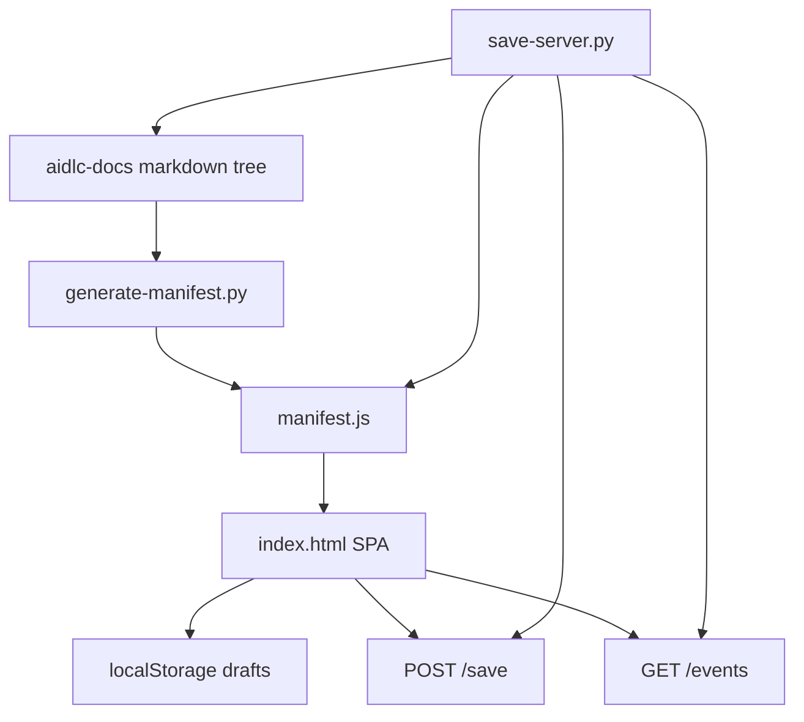
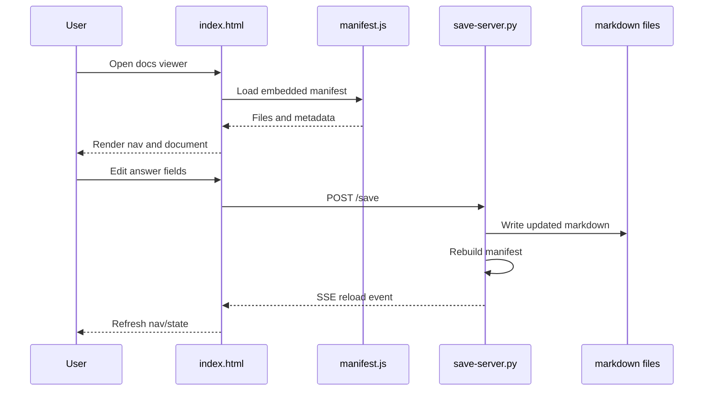

# System Architecture

## System Overview

The current solution is a browser-first documentation viewer composed of one static HTML application and two optional Python helper scripts. It is optimized for zero-build portability: markdown is pre-bundled into a generated JavaScript manifest, and the UI can run directly from disk or behind a lightweight local HTTP server.

## Architecture Diagram

## Text Alternative

- Markdown content is the source of truth.
- `generate-manifest.py` scans the docs tree and writes `manifest.js`.
- `index.html` loads `manifest.js` and builds the interactive UI in the browser.
- The viewer stores unsaved answer drafts in `localStorage`.
- When the optional server is used, the viewer can save file changes and subscribe to live-reload events.

## Component Descriptions

### `index.html`

- **Purpose**: Main application shell.
- **Responsibilities**: Static layout, CSS theme, runtime navigation, markdown rendering, search filtering, Mermaid rendering, answer-field transformation, saving, and live reload.
- **Dependencies**: `manifest.js`, CDN `marked`, CDN `highlight.js`, CDN `mermaid`, browser APIs.
- **Type**: Application.

### `generate-manifest.py`

- **Purpose**: Build-time content packager.
- **Responsibilities**: Traverse docs tree, exclude hidden/private folders, infer document titles, detect AIDLC phase grouping, and emit the JavaScript manifest.
- **Dependencies**: Python standard library.
- **Type**: Utility.

### `save-server.py`

- **Purpose**: Local editing backend.
- **Responsibilities**: Serve static files, rebuild the manifest, expose save endpoint, and push reload events over SSE.
- **Dependencies**: Python standard library.
- **Type**: Utility.

### `manifest.js`

- **Purpose**: Generated runtime asset.
- **Responsibilities**: Hold project title, generated timestamp, and full markdown payload list.
- **Dependencies**: Generated by `generate-manifest.py` or `save-server.py`.
- **Type**: Data asset.

## Data Flow

## Integration Points

- **Markdown Filesystem**: Source documents scanned and optionally updated in place.
- **Browser Storage**: `localStorage` stores unsaved answer drafts per file path.
- **External Libraries**: CDN-hosted `marked`, `highlight.js`, and `mermaid`.
- **Local HTTP API**: `/save` for writes and `/events` for live reload.

## Infrastructure Components

- **Execution Model**: Static file viewer with optional local Python HTTP server.
- **Deployment Model**: Direct `file://` usage or local `http://localhost:8765`.
- **State Model**: Source-of-truth markdown files plus browser draft cache.
