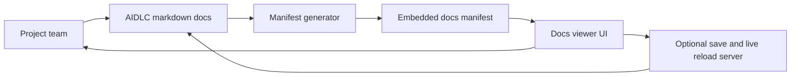

# Business Overview

## Business Context Diagram

## Text Alternative

- Project team authors and edits AIDLC markdown documents.
- A Python generator scans those documents and builds an embedded JavaScript manifest.
- The browser viewer reads that manifest and renders navigation, search, markdown, code blocks, Mermaid diagrams, and answer editing.
- An optional local Python server can save edited markdown back to disk and notify the viewer to refresh.

## Business Description

- **Business Description**: The system provides a portable viewer for AIDLC documentation trees so teams can browse, search, read, answer workflow questions, and optionally save edits back into markdown files.
- **Business Transactions**:
  - Index all markdown files under an AIDLC documentation root.
  - Build a browser-consumable manifest with content and metadata.
  - Render docs grouped by AIDLC phase and section.
  - Search documents and navigate by hash-based routing.
  - Render Mermaid diagrams and highlighted code blocks.
  - Convert standalone `[Answer]:` markers into editable answer fields.
  - Save updated answers back to markdown files through a local HTTP endpoint.
  - Watch documentation changes and live-refresh navigation through server-sent events.
- **Business Dictionary**:
  - **Manifest**: Generated JavaScript payload containing all indexed markdown documents.
  - **Viewer**: The static single-page interface that renders the manifest.
  - **Answer field**: Editable UI mapped to a standalone `[Answer]:` line in markdown.
  - **Docs root**: The folder containing `aidlc-docs/` markdown content to index.
  - **Phase group**: The top-level navigation bucket derived from `overview`, `inception`, `construction`, `operations`, or `other`.

## Component Level Business Descriptions

### `index.html`

- **Purpose**: Delivers the entire user experience for browsing and editing AIDLC docs.
- **Responsibilities**: Layout, navigation tree building, markdown rendering, Mermaid handling, local draft persistence, answer editing, save actions, and live-reload connection.

### `generate-manifest.py`

- **Purpose**: Turns the documentation tree into a self-contained dataset the UI can load with `file://`.
- **Responsibilities**: Scan markdown files, derive titles and phase metadata, embed content in JavaScript, and optionally watch for changes.

### `save-server.py`

- **Purpose**: Enables in-place editing and live refresh for local workflows that need more than a static file viewer.
- **Responsibilities**: Serve the viewer, accept save requests, rebuild the manifest, and broadcast reload notifications.

### `manifest.js`

- **Purpose**: Provides the runtime content payload used by the viewer.
- **Responsibilities**: Expose `window.AIDLC_MANIFEST` with project metadata and file contents.
