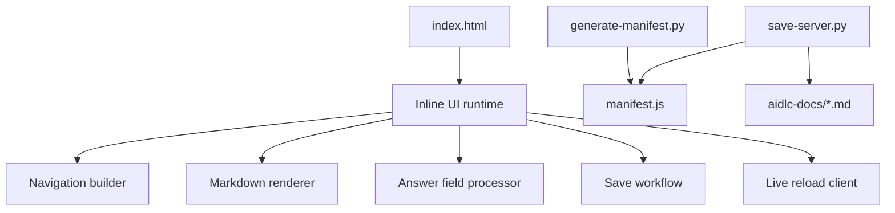

# Code Structure

## Build System

- **Type**: No frontend bundler today; package metadata plus standalone Python scripts.
- **Configuration**:
  - `package.json` contains basic project metadata only.
  - `index.html` is a self-contained SPA with inline CSS and JavaScript.
  - `generate-manifest.py` produces `manifest.js`.
  - `save-server.py` serves and edits the viewer locally.

## Module Hierarchy

## Text Alternative

- `index.html` contains all presentation and interaction logic.
- The runtime logic branches into navigation, rendering, answer editing, saving, and live reload.
- Both Python scripts cooperate around `manifest.js`.

## Existing Files Inventory

- `index.html` - static single-page viewer with inline styling and all client-side behavior.
- `manifest.js` - generated manifest consumed by the viewer.
- `generate-manifest.py` - manifest builder and file watcher.
- `save-server.py` - local save server and SSE-based live reload service.
- `package.json` - minimal npm metadata, not yet a real application build definition.
- `README.md` - usage and portability documentation for the current static viewer.

## Design Patterns

### Single-File SPA

- **Location**: `index.html`
- **Purpose**: Keep the viewer portable and runnable without a build step.
- **Implementation**: HTML, CSS, and JavaScript all live in one file.

### Generated Content Manifest

- **Location**: `generate-manifest.py`, `manifest.js`, `save-server.py`
- **Purpose**: Avoid browser filesystem restrictions by embedding docs into JavaScript.
- **Implementation**: Python scans markdown and serializes the full content tree into `window.AIDLC_MANIFEST`.

### Progressive Local Editing

- **Location**: `index.html`, `save-server.py`
- **Purpose**: Support richer local workflows without requiring a full backend in static mode.
- **Implementation**: The viewer tries a local save API first and falls back to download guidance when unavailable.

### Client-Side Draft Persistence

- **Location**: `index.html`
- **Purpose**: Prevent accidental loss of typed answers before save.
- **Implementation**: Drafts are stored in `localStorage` keyed by file path.

## Critical Dependencies

### `marked`

- **Version**: `9.1.6` via CDN.
- **Usage**: Markdown to HTML conversion.
- **Purpose**: Render AIDLC markdown content in the browser.

### `highlight.js`

- **Version**: `11.9.0` via CDN.
- **Usage**: Syntax highlighting for fenced code blocks.
- **Purpose**: Improve readability of code examples.

### `mermaid`

- **Version**: `10.6.1` via CDN.
- **Usage**: Render diagrams from fenced Mermaid blocks.
- **Purpose**: Support AIDLC visual workflow documentation.
