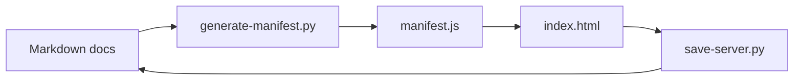

# Dependencies

## Internal Dependencies

## Text Alternative

- The docs tree feeds the manifest generator.
- The generated manifest feeds the browser viewer.
- The viewer optionally calls the save server.
- The save server writes back to the docs tree and refreshes the manifest.

## Dependency Relationships

### `index.html` depends on `manifest.js`

- **Type**: Runtime.
- **Reason**: The viewer requires the embedded file list and markdown content to render anything.

### `index.html` depends on CDN libraries

- **Type**: Runtime.
- **Reason**: Markdown parsing, syntax highlighting, and Mermaid rendering are delegated to external browser libraries.

### `save-server.py` depends on generator logic

- **Type**: Runtime.
- **Reason**: The local server rebuilds the manifest whenever docs change or are saved.

### Both Python scripts depend on the docs filesystem

- **Type**: Runtime.
- **Reason**: Markdown files are both the source for indexing and the target for persisted edits.

## External Dependencies

### `marked`

- **Version**: `9.1.6`
- **Purpose**: Render markdown in the viewer.
- **License**: MIT.

### `highlight.js`

- **Version**: `11.9.0`
- **Purpose**: Render syntax-highlighted code blocks.
- **License**: BSD-3-Clause.

### `mermaid`

- **Version**: `10.6.1`
- **Purpose**: Render workflow and sequence diagrams.
- **License**: MIT.

### Python standard library

- **Version**: Host Python runtime.
- **Purpose**: Filesystem scanning, HTTP serving, JSON serialization, and threading.
- **License**: PSF.
